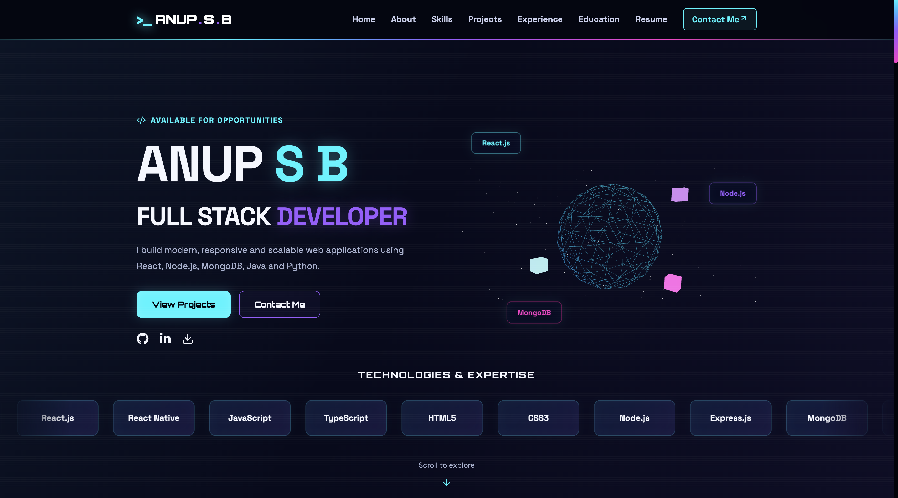

# 🍽️ Culinary Inquiry

### *Where food meets science, curiosity meets flavor.*

<p align="center">
  
</p>

<p align="center">
  <strong>A cinematic food science journal built with React, TypeScript & Vite.</strong>
</p>

<p align="center">
  <a href="https://github.com/anupsb2003/Food-blog">
    
  </a>
  
  
  
</p>

---

## ✦ About the Project

**Culinary Inquiry** is an immersive digital food science journal that explores the fascinating stories behind everyday food.

Why does bread turn golden? What makes coffee aromatic? How do ingredients transform when heated, fermented, or combined?

This project brings together **food science, culinary storytelling, and modern frontend development** to create a visually rich web experience inspired by premium editorial magazines.

> Every ingredient has a story.
> Every recipe has a science.
> Every bite has a reason.

---

## ✨ Explore the Journal

<table>
<tr>
<td width="50%">

### 📖 The Diaries

Discover stories, articles, and observations about food, ingredients, and cooking.

</td>
<td width="50%">

### 🧪 Label Lab

Decode food labels, ingredients, nutrition information, and packaging.

</td>
</tr>
<tr>
<td width="50%">

### 🔥 Browning Files

Explore the science behind the color, flavor, and aroma of cooked food.

</td>
<td width="50%">

### 🌾 Field Notes

Discover ingredients, culinary techniques, experiments, and food culture.

</td>
</tr>
</table>

---

## 🎨 Design Philosophy

A cinematic editorial experience inspired by premium food magazines.

* 🌑 Dark, immersive visual design
* ✍️ Bold editorial typography
* 🎬 Food-focused visual storytelling
* ✨ Smooth animations and transitions
* 🧩 Reusable React components
* 📱 Responsive layouts for every screen
* 🎯 Minimal navigation with premium spacing
* 🍳 A blend of science, culture, and culinary curiosity

---

## 🚀 Features

| Feature                   | Description                                      |
| ------------------------- | ------------------------------------------------ |
| 🎞️ Animated Hero         | Eye-catching introduction with immersive visuals |
| 🧭 Interactive Navigation | Smooth navigation across journal sections        |
| 🍽️ Food Storytelling     | Editorial layouts designed around food science   |
| ✨ Motion Design           | Animated buttons, reveals, and transitions       |
| 📱 Responsive UI          | Optimized for desktop, tablet, and mobile        |
| 🧩 Component Architecture | Reusable and maintainable React components       |
| ⚡ Vite Development        | Fast development and optimized builds            |
| 🔷 TypeScript             | Type-safe frontend development                   |

---

## 🛠️ Built With

<p align="center">
  
</p>

| Technology   | Purpose                                    |
| ------------ | ------------------------------------------ |
| React.js     | Building interactive UI                    |
| TypeScript   | Type-safe development                      |
| Vite         | Development and production tooling         |
| JavaScript   | Application logic                          |
| HTML5        | Semantic page structure                    |
| CSS3         | Styling, animations, and responsive design |
| Git & GitHub | Version control                            |

---

## 📂 Project Structure

```text
Food-blog/
│
├── public/
│   ├── images/
│   └── videos/
│
├── src/
│   ├── assets/
│   │   └── image.png
│   ├── components/
│   ├── pages/
│   ├── styles/
│   ├── App.tsx
│   └── main.tsx
│
├── index.html
├── package.json
├── tsconfig.json
├── vite.config.ts
└── README.md
```

---

## ⚡ Getting Started

### Prerequisites

Make sure you have installed:

* Node.js
* npm or Yarn
* Git

### 1. Clone the repository

```bash
git clone https://github.com/anupsb2003/Food-blog.git
```

### 2. Open the project

```bash
cd Food-blog
```

### 3. Install dependencies

```bash
npm install
```

### 4. Start the development server

```bash
npm run dev
```

Your application will be available at:

```text
http://localhost:5173
```

---

## 📦 Production Build

Build the project:

```bash
npm run build
```

Preview the production build:

```bash
npm run preview
```

---

## 🌐 Live Preview

<p align="center">

🚧 **Live website coming soon**

</p>

Add your deployed website link here:

```text
https://your-deployed-link.com
```

---

## 🔮 Future Roadmap

* [ ] Add a complete article management system
* [ ] Add individual article pages
* [ ] Add search and category filtering
* [ ] Add newsletter subscription
* [ ] Integrate a CMS
* [ ] Add more food science experiments
* [ ] Improve SEO optimization
* [ ] Add dark and light theme support
* [ ] Add interactive food science animations
* [ ] Deploy the website for public access

---

## 🎯 Purpose of the Project

Culinary Inquiry combines two passions:

**The science of food × The art of frontend development**

The project demonstrates how modern web technologies can transform educational food content into an engaging digital experience.

It explores:

* Food science
* Cooking techniques
* Ingredient knowledge
* Culinary culture
* Interactive web design
* Modern frontend development

---

## 👨‍💻 Author

<p align="center">
  <strong>ANUP S B</strong><br/>
  Full Stack Developer
</p>

<p align="center">
  <a href="https://github.com/anupsb2003">GitHub</a> •
  <a href="https://www.linkedin.com/in/anup-s-b-4095812b4/">LinkedIn</a>
</p>

---

## 📜 License

This project is created for learning, portfolio, and demonstration purposes.

---

<p align="center">
  <strong>Made with curiosity, code & a love for food. 🍳</strong>
</p>

<p align="center">
  ⭐ If you find this project interesting, consider giving it a star!
</p>
